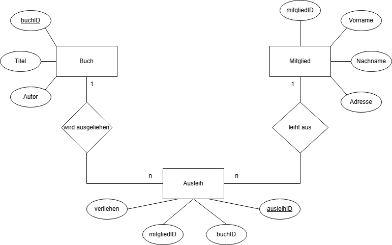

# Bibliotheksverwaltung API

## Einführung
Diese API dient der Verwaltung einer Bibliothek mit den Kernfunktionen:
- Verwaltung von Büchern, einschließlich Hinzufügen, Abrufen und Löschen.
- Verwaltung von Mitgliedern, einschließlich Registrierung und Abrufen von Mitgliedsdaten.
- Verwaltung von Ausleihen, um Bücher zu verleihen und zurückzugeben.

## Installation & Start
### Voraussetzungen
Um die API zu nutzen, müssen Node.js und npm installiert sein.

### Installation
Die benötigten Abhängigkeiten können mit npm installiert werden.

### Starten der API
Die API kann durch Starten des Hauptskripts ausgeführt werden.

## Endpunkte
Die API stellt verschiedene Endpunkte für Bücher, Mitglieder und Ausleihen bereit. Benutzer können Bücher hinzufügen, auflisten und löschen. Mitglieder können registriert und aufgelistet werden. Das System ermöglicht es auch, Bücher an Mitglieder zu verleihen und zurückzunehmen.

## Datenmodell
Das System basiert auf drei Hauptentitäten:
- Bücher: Enthält Informationen zu Titel, Autor und Verfügbarkeit.
- Mitglieder: Speichert Daten wie Name, E-Mail und Mitgliedschaftsstatus.
- Ausleihen: Verknüpft Bücher mit Mitgliedern und speichert Informationen zur Leihfrist.

## Diagramm
Dieses Diagramm zeigt die Beziehungen zwischen den Entitäten und erleichtert das Verständnis der Datenbankstruktur.

Wie auf dem Diagramm zu sehen gibt es nun folgende Beziehungen zwischen den Entitäten:

Mitglied:
1:N Beziehung zu Ausleih → "Ein Mitglied kann mehrere Ausleihen haben."

Buch:
1:N Beziehung zu Ausleih → "Ein Buch kann mehrfach ausgeliehen werden."

Ausleih:
Enthält Fremdschlüssel zu Mitglied und Buch → Verknüpft Bücher und Mitglieder.

## Lizenz
Die Bibliotheksverwaltung API steht unter der MIT License zur freien Nutzung zur Verfügung.